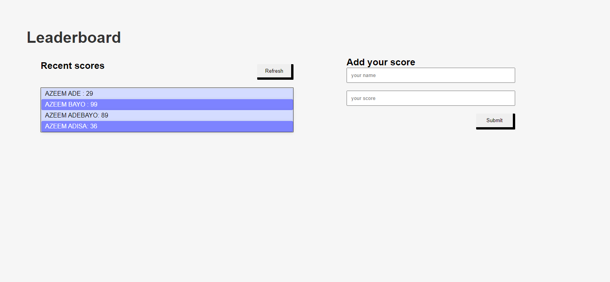

# Leaderboard
The leaderboard website displays scores submitted by different players. It also allows you to submit your score. All data is preserved with an external Leaderboard API service. The project is a JavaScript project using webpack and ES6 features and notably modules.

## VIEW
SCREENSHOT OF DESKTOP VERSION )

## Built With

- HTML
- CSS
- Git and Github
- Technologies used

## Live Demo

<a href= "https://zemola.github.io/Leaderboard/dist/">To-do list App</a>

**Instructions on how to access my project locally.**

 To Access my project locally please follow either of the two steps listed below ;

STEP 1
1. Enter this url:  https://github.com/zemola/Leaderboard.git in your web browser.
2. Once opened navigate to the top left level of the project a green code download button will be visible on the righthand side.
3. click on the green button with name "Code", Select download Zip option from drop down menu.
4. Once the download is extract the zip file into any folder of your choice on your system.
5. you will be able to access my project locally.

STEP 2
1. Open command prompt
2. go to the designated folder where you want to clone the repository to.
3. enter  git clone https://github.com/zemola/Leaderboard.git
4. open your designated folder.
5. you will be able to access my project locally.

### Prerequisites
- You should have basic knowledge of HTML
- You should have basic knowledge of CSS
- Also, a basic knowledge of git and github
- A code editor: I used VScode for this project but you can use any code editor of your choice

### Setup
- follow steps on this link to set up VScode code editor: [setup vscode](https://www.freecodecamp.org/news/how-to-set-up-vs-code-for-web-development/)

### Install
[download](https://code.visualstudio.com/download) VScode.
[Watch this video](https://www.youtube.com/watch?v=MlIzFUI1QGA) on how to install VScode on windows

## Author

👤 **Olatunji Azeem**

- GitHub: [@githubhandle](https://github.com/zemola)
- Twitter: [@twitterhandle](https://twitter.com/zemolat)
- LinkedIn: [LinkedIn](https://www.linkedin.com/in/olatunjiazeem/)

## 🤝 Contributing

Contributions, issues, and feature requests are welcome!

Feel free to check the [issues page](https://github.com/zemola/Leaderboard/issues).

## Show your support
Give a ⭐️ if you like this project!

## 📝 License

This project is [MIT](./MIT.md) licensed.